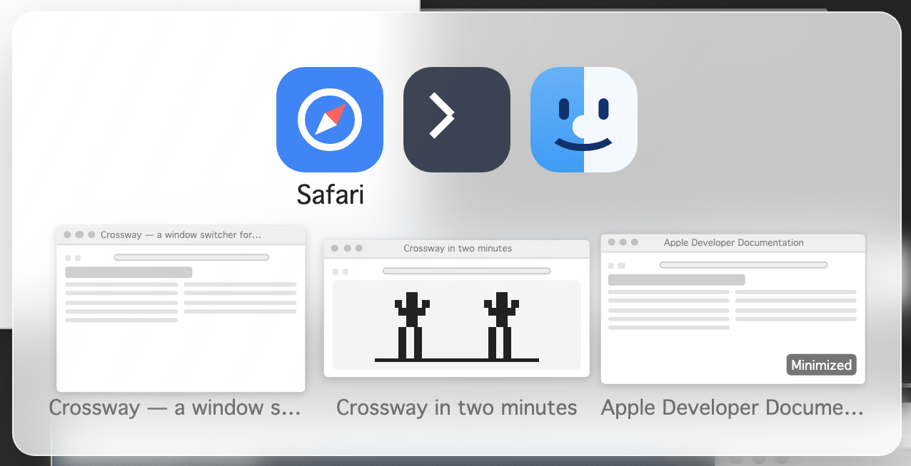

# Crossway

[](https://github.com/crossway-app/Crossway-Releases/releases/latest)

**Website: [crosswayapp.com](https://crosswayapp.com/)**

**A fast ⌘Tab window switcher for macOS.**

Crossway replaces the built-in app switcher with one that understands *windows*, not just apps:

- **⌘Tab** — switch apps exactly like the native switcher. Hold a beat longer and live thumbnail previews of the highlighted app's windows appear beneath it.
- **⌘`** — cycle through the *windows* of the highlighted app and jump straight to the one you want, without touching the trackpad.
- **⌥Tab / ⌥`** — an exposé-style grid of every open window (or just the current app's windows), with window titles and Dock badges.
- Keyboard-first, with full mouse support: hover to select, click to activate, arrow keys work on every surface.
- Quick taps behave exactly like native macOS — Crossway's UI only appears when you *hold* the shortcut.

<!-- HELD until 2.0 (distribution/releases-repo/HOLD): That is the short version. [The full list of features](https://crosswayapp.com/features/) has every command, setting and privacy promise, with a link for each. -->



## Requirements

- macOS 14 to 26.
- Apple Silicon or Intel (the app is universal).

## Download

### [⬇️ Download the latest Crossway.zip](https://github.com/crossway-app/Crossway-Releases/releases/latest/download/Crossway.zip)

Or let an agent install it for you. Paste this into Claude Code, Codex, or another agent:

```
Install Crossway: https://crosswayapp.com/SKILL.md
```

Every build is signed with an Apple Developer ID certificate and notarized by Apple. Older versions and release notes are on the [Releases page](https://github.com/crossway-app/Crossway-Releases/releases).

**Always download in a web browser from this page.** Don't pass the zip around through chat apps — macOS marks files saved by messenger apps so they can never run (see Troubleshooting below).

## Install

1. Unzip the download (double-click `Crossway.zip`).
2. Drag `Crossway.app` into your `/Applications` folder.
3. Open it. Crossway lives in the **menu bar** — there is no Dock icon.
4. Grant the two permissions it asks for in **System Settings → Privacy & Security**:
   - **Accessibility** — needed to take over ⌘Tab and to raise the window you pick.
   - **Screen Recording** — needed for the window thumbnail previews.
5. Follow the in-app setup. In the final Startup choices, **Launch at login** starts
   on; **Auto-update** stays off unless you choose it. Crossway notices the grants
   and completes any required relaunch itself; you do not need to relaunch it manually.

Crossway records nothing and uploads nothing. Auto-update is optional and opt-in, off by default, and checks only on the schedule you choose. Crossway fetches release metadata from GitHub; it never downloads or installs an update itself. The same metadata-only check is always available manually from **menu-bar icon → Check for Updates…**. That is the app's entire network surface—no telemetry, identifiers, or uploads. When an update is available, Crossway offers a deliberate browser download; you replace the app yourself.

## Troubleshooting

**"The application "Crossway.app" can't be opened." (a plain dialog with only an OK button)**
The zip most likely reached your Mac through a chat app (WhatsApp, Telegram, and similar). macOS marks files saved by those apps so they can never run, no matter how the app is signed. Fix — paste this into Terminal, then open the app again:

```
xattr -r -d com.apple.quarantine /Applications/Crossway.app
```

To avoid this entirely, download the zip in your browser from this page instead of receiving it through a messenger.

**"Crossway is damaged and can't be opened."**
The zip was modified on its way to you. Delete the app and re-download it from this page.

**"Crossway can't be opened because Apple cannot check it for malicious software."**
Same cause — a re-zipped or mangled copy. Re-download from this page in a browser.

**"Crossway requires macOS 14.0 or later."**
Your Mac runs an older macOS. Crossway needs macOS 14 (Sonoma) or newer; there is no workaround.

**"Crossway was not downloaded from the App Store."**
Your Gatekeeper setting allows App Store apps only. In System Settings → Privacy & Security, set "Allow applications downloaded from" to **App Store and identified developers** (on newer macOS: "App Store & Known Developers").

## Which version am I running?

- **When downloading:** the release title says it — for example *Crossway 1.11* — and every release also includes a version-named copy of the zip (like `Crossway-1.11.zip`), so the file itself tells you what it is.
- **Once installed:** click the Crossway menu-bar icon → **Settings…** — your version is shown at the bottom of the Settings window. Or select `/Applications/Crossway.app` in Finder and press ⌘I (Get Info).
- **To see if you're current:** click the menu-bar icon → **Check for Updates…**, or **Check now** beside Auto-update in **Settings → General → Startup**, for a manual check; or opt into **Auto-update** there and choose a schedule. Each compares your build against the newest release here; if something newer is available, Crossway offers the browser download.

## Terms

Crossway is free to use. The source code is private, and this page is the only official download location — please link people here rather than re-hosting the zip.
